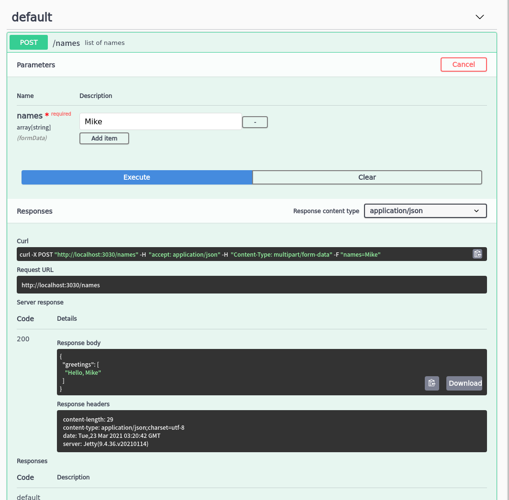
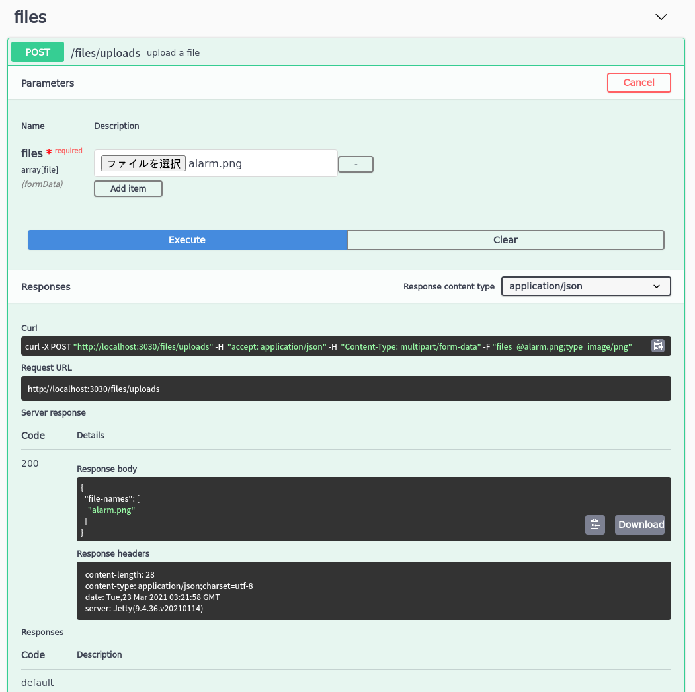

# reitit-swagger-playground

Some reitit routing playgrounds.

This repo shows below examples:

- multiple input for formdata input

  _/names_ and _/files_ endpoints show it.

## Installation

clone this repo, please

## Usage

The below command run server, then, you can access _localhost:3030_ allows you to see Swagger.

    $ lein run

## Captures

### /names

### /files

